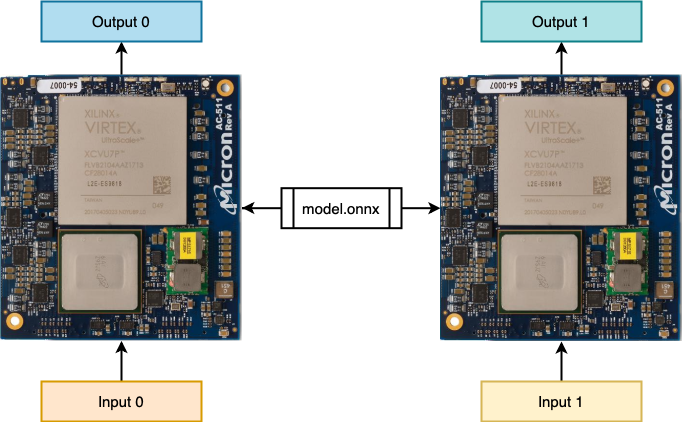
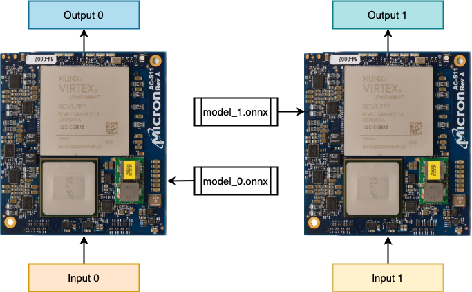
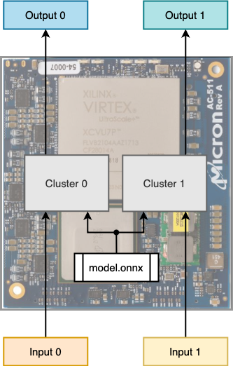
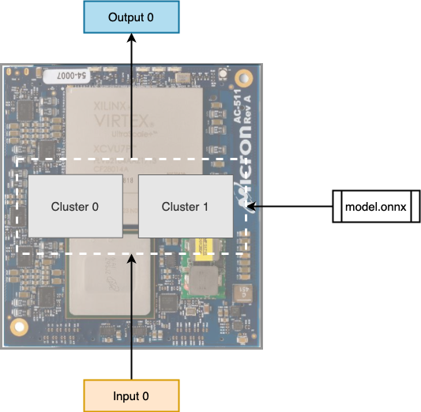

# FWDNXT SDK

FWDNXT Software Developement Kit - SDK
To register and download, please send a request to info@fwdnxt.com

# FWDNXT set-up steps

1. Obtain necessary hardware: This SDK supposes that you are working on a desktop computer with Micron FPGA boards on a PCI backplane (AC-510 and EX-750 for example).
2. Install pico-computing tools and FWDNXT SDK. Check section [1.](#1-installation)
3. Run a sample example. Check sections [3.](#3-getting-started-inference-on-fwdnxt-hardware) and [4.](#4-getting-started-inference-on-fwdnxt-hardware-with-c)
4. Create your own application


[**Python API**](docs/PythonAPI.md): Documentation of the python API can be found in docs/PythonAPI.md.

[**C API**](docs/C%20API.md): Documentation of the C/C++ API can be found in docs/C API.md.


## Table of Contents:

- [1. Installation](#1-installation) : install SDK
  * [System requirements](#system-requirements)
  * [Software requirements](#software-requirements)
  * [Recommended Installation](#recommended-installation)
  * [Offline Installation](#offline-installation)
  * [Manual Installation](#manual-installation)
- [2. Getting started with Deep Learning](#2-getting-started-with-deep-learning) : general information about deep learning
  * [Introduction](#introduction)
  * [Suggested computing hardware](#suggested-computing-hardware)
  * [PyTorch: Deep Learning framework](#pytorch--deep-learning-framework)
  * [My dataset](#my-dataset)
  * [Training a neural network with PyTorch](#training-a-neural-network-with-pytorch)
  * [After training a neural network](#after-training-a-neural-network)
- [3. Getting started Inference on FWDNXT hardware](#3-getting-started-inference-on-fwdnxt-hardware) : getting started tutorial for running inference on the Inference Engine
- [4. Getting started Inference on FWDNXT hardware with C](#4-getting-started-inference-on-fwdnxt-hardware-with-c) : getting started tutorial for running inference on the Inference Engine using C
- [5. Tutorial - Multiple FPGAs and Clusters](#5-tutorial---multiple-fpgas-and-clusters) : tutorial for running inference on multiple FPGAs and clusters
  * [Table of Contents](#table-of-contents)
  * [Multiple FPGAs with input batching <a name="one"></a>](#multiple-fpgas-with-input-batching--a-name--one----a-)
  * [Multiple FPGAs with different models <a name="two"></a>](#multiple-fpgas-with-different-models--a-name--two----a-)
  * [Multiple Clusters with input batching <a name="three"></a>](#multiple-clusters-with-input-batching--a-name--three----a-)
  * [Multiple Clusters without input batching <a name="four"></a>](#multiple-clusters-without-input-batching--a-name--four----a-)
- [6. Using with Tensorflow](#6-using-with-tensorflow) : Tutorial on using tensorflow with the Inference Engine
  * [Installation](#installation)
  * [Using a tf2onnx converter from ONNX (recommended for SDK releases since 0.3.11)](#using-a-tf2onnx-converter-from-onnx--recommended-for-sdk-releases-since-0311-)
  * [Using a tf2onnx converter from FWDNXT (recommended for SDK releases before 0.3.11)](#using-a-tf2onnx-converter-from-fwdnxt--recommended-for-sdk-releases-before-0311-)
  * [TF-Slim models tested on FWDNXT inference engine](#tf-slim-models-tested-on-fwdnxt-inference-engine)
- [7. Supported models and layers](#7-supported-models-and-layers) : List of supported layers and models tested on the Inference Engine
  * [Tested models](#tested-models)
    + [ONNX model zoo:](#onnx-model-zoo-)
- [8. Troubleshooting and Q&A](#8-troubleshooting-and-q-a) : Troubleshooting common issues and answering common questions


Please report issues and bugs [here](https://github.com/FWDNXT/SDK/issues).


# 1. Installation

## System requirements

This SDK supposes that you are working on a desktop computer with Micron FPGA boards on a PCI backplane (AC-510 and EX-750 for example).  

Tested on: 
  - Ubuntu 14.04 LTS Release, Kernel 4.4.0
  - Ubuntu 16.04 LTS Release, Kernel 4.13.0
  - CentOS 7.5

## Software requirements
- GCC 4.9 or higher
- [Pico-computing tools](https://picocomputing.zendesk.com/hc/en-us/): verify pico-computing functionality by refering to the document "PicoUsersGuide.pdf" and section "Running a Sample Program"
- Python 3 together with numpy
- [Thnets](https://github.com/mvitez/thnets/)

## Recommended Installation

The install script is located in sdk/


This script requires internet connection to install the necessary packages. Installation of the SDK can be run with:

`sudo ./install.sh`

## Offline Installation
The off-line install script is different from the one in sdk/

The install.sh in the offline installer folder will install all packages needed by the SDK and optionally install supporting third-party packages.

All-in-one installation of the SDK can be run with:

`sudo ./install.sh <username>` 

## Manual Installation

**Install protobuf to use ONNX support (required by SDK)**

```
wget https://github.com/google/protobuf/releases/download/v3.5.1/protobuf-all-3.5.1.zip
unzip protobuf-all-3.5.1.zip
cd protobuf-3.5.1
./configure
make -j4
make check -j4
sudo make install
sudo ldconfig
```

**Install Thnets with ONNX support (required by SDK)**

```
git clone https://github.com/mvitez/thnets/
cd thnets
make ONNX=1
sudo make install
```


**Install pytorch (optional for genonnx.py; not required by SDK)**

Install this if you want to convert models from PyTorch to ONNX on your own.

Choose your system configuration at pytorch.org and install the corresponding package.

On ARM CPU you will have to install pytorch from source.

Check torch version with: `pip show torch`


# 2. Getting started with Deep Learning

Version: 1.0

Date: January 23rd, 2018

## Introduction

This is a very concise tutorial to help beginners learn how to create and train a Deep Learning model for use with FWDNXT demonstrations, SDK and other products.

Users should have knowledge of Linux and Ubuntu environments, personal computer or workstation maintenance and command line tools, and experience with the Python programming language. Additionally experience in C, C++, CUDA and GPU programming language may be needed for training advanced modules, but not required at the beginning, as PyTorch offers already implemented functions.

## Suggested computing hardware

Here is a link to recommended hardware to train Deep neural networks:

[https://medium.com/@culurciello/our-gpu-machines-6d14a28511b8](https://medium.com/@culurciello/our-gpu-machines-6d14a28511b8). This shows an example configuration of a high-performance personal computer that users can purchase and assemble to train deep neural network models. Assembled machines can also be purchased, for example here: [https://lambdal.com/](https://lambdal.com/).

FWDNXT provides these link and examples as is, without any implied warranty.

## PyTorch: Deep Learning framework

FWDNXT recommends the use of PyTorch [http://pytorch.org/](http://pytorch.org/) as Deep Learning framework. PyTorch is a CPU and GPU tested and ready framework, allowing users to train small models on CPU and larger and faster models on GPUs. PyTorch also features Dynamic Neural Networks, a version of Autograd - automatic differentiation of computational graphs that can be recorded and played like a tape. All this in simple means that PyTorch offers simpler ways to create custom complex models, and that users will see the benefits of PyTorch when trying to create and debug advanced neural network models.

PyTorch tutorials from beginners to more advanced are linked here: [http://pytorch.org/tutorials/](http://pytorch.org/tutorials/).

## My dataset

We recommend users try to train public models first. Here is a link to some public models and tools for PyTorch: [http://pytorch.org/docs/master/torchvision/datasets.html](http://pytorch.org/docs/master/torchvision/datasets.html).

For image-based datasets, we recommend the folder of folders arrangement: The dataset is a folder DATASET1 and inside there are multiple directory OBJ1, OBJ2, etc, each with multiple image files: obj1-file1.jpg, obj1-file2.png, etc.

## Training a neural network with PyTorch

Training a deep neural network with PyTorch is very simple, and many examples of training scripts: [https://github.com/pytorch/examples](https://github.com/pytorch/examples).

For example, a good starting point is to train FWDNXT supported models on an image classification task. We recommend using this training script:

[https://github.com/pytorch/examples/tree/master/imagenet](https://github.com/pytorch/examples/tree/master/imagenet). This script can load a custom dataset of images, please refer to the requirements in the script README file.

## After training a neural network

After training a neural network with PyTorch, you model is ready for use in FWDNXT SDK. Please refer to the SDK manual for use with FWNDXT products.


# 3. Getting started Inference on FWDNXT hardware  

This tutorial will teach you how to run inference on hardware. We will use a neural network pre-trained on ImageNet.
The program will process an image and return the top-5 classification of the image. A neural network trained for an object 
categorization task will output a probability vector. Each element of the vector contains the probability to its correspondent 
category that is listed in a categories file.  
In this tutorial you will need:
* One of the [pre-trained models](http://fwdnxt.com/models/)
* [Input image](./test-files): located in /test-files/
* [Categories file](./test-files/categories.txt): located in /test-files/
* [simpledemo.py](./examples/python/simpledemo.py): located in /examples/python/


**Pytorch and torchvision pretrained model on ImageNet**

In the SDK folder, there is `genonnx.py`. This script will create an ONNX file from [torchvision models](https://github.com/pytorch/vision/tree/master/torchvision).
This utility requires the latest pytorch and it can create a ONNX file from most networks present in the
torchvision package and also from networks in the pth format.

`python3 genonnx.py alexnet`

This command will download a pre-trained alexnet network and create a file called alexnet.onnx

For more information about onnx please visit [https://onnx.ai/](https://onnx.ai/)

To convert tensorflow models into ONNX files please reference the section [6. Using with Tensorflow](#6-using-with-tensorflow)

**Running inference on FWDNXT hardware for one image**

In the SDK folder, there is simpledemo.py, which is a python demo application.  
Its main parts are:

1) Parse the model and generate instructions
2) Get and preprocess input data
3) Init FWDNXT hardware
4) Run FWDNXT hardware
5) Get and display output

The user may modify steps 1 and 5 according to users needs.
Check out other possible application programs using FWDNXT hardware [here](http://fwdnxt.com/).
The example program is located in examples/python/
You can run the demo using this command:

`python3 simpledemo.py <onnx file> <picture> -c <categories file.txt> -l`

`-l` option will load the hardware into a FPGA card. Note: make sure the bitfile is in same directory of `simpledemo.py`, or change the path in the program.   


Loading the FPGA and bringing up the HMC will take at max 5 min.
Loading the FPGA only fails when there are no FPGA cards available. If you find issues in loading FPGA check out [Troubleshooting](Troubleshooting.md).  
After the first run, FWDNXT hardware will be loaded in the FPGA card. The following runs will not need to load the hardware anymore.
You can run the network on hardware with this command, which will find the FPGA card that was loaded with FWDNXT hardware:

`python3 simpledemo.py <onnx file> <picture> -c <categories file.txt> -l`

If you used the example image with alexnet, the demo will output:

```
  Doberman, Doberman pinscher 24.4178

  Rottweiler 24.1749

  black-and-tan coonhound 23.6127

  Gordon setter 21.6492

  bloodhound, sleuthhound 19.9336
```


# 4. Getting started Inference on FWDNXT hardware with C 

This tutorial will teach you how to run inference on the Inference Engine using C code. We will use a neural network pre-trained on ImageNet.
The program will process an image and return the top-5 classification of the image.  
In this tutorial you will need:
* One of the [pre-trained models](http://fwdnxt.com/models/)
* [Input image](./test-files): located in /test-files/
* [Categories file](./test-files/categories.txt): located in /test-files/
* [Source code](./examples/C): located in /examples/C/


**Running inference on the Inference Engine for one image**

In the SDK folder, there is compile.c, which compiles a ONNX model and outputs Inference Engine instructions into a .bin file.
The simpledemo.c program will read this .bin file and execute it on the Inference Engine.  
The main functions are:
1) ie_compile: parse ONNX model and generate the Inference Engine instructions.
2) ie_init: load the Inference Engine bitfile into FPGA and load instructions and model parameters to shared memory.
3) ie_run: load input image and execute on the Inference Engine.

Check out other possible application programs using the Inference Engine [here](http://fwdnxt.com/).  
To run the demo, first run the following commands:

```
cd <sdk folder>/examples/C
make
./compile -m <model.onnx> -i 224x224x3 -o instructions.bin
```
Where `-i` is the input sizes: width x height x channels.  
After creating the `instructions.bin`, you can run the following command to execute it: 

`./simpledemo -i <picturefile> -c <categoriesfile> -s ./instructions.bin -b <bitfile.bit>`

`-b` option will load the specified Inference Engine bitfile into a FPGA card.  
Loading the FPGA and bringing up the HMC will take at max 5 min.
Loading the FPGA only fails when there are no FPGA cards available. If you find issues in loading FPGA check out [Troubleshooting](Troubleshooting.md).  
After the first run, the Inference Engine will be loaded in the FPGA card. The following runs will not need to load the Inference Engine bitfile anymore.
You can run the network on the Inference Engine with this command, which will find the FPGA card that was loaded with the Inference Engine:

`./simpledemo -i <picturefile> -c <categoriesfile> -s ./instructions.bin`

If you used the example image with alexnet, the demo will output:

```
black-and-tan coonhound -- 23.9883
Rottweiler -- 23.6445
Doberman -- 23.3320
Gordon setter -- 22.0195
bloodhound -- 21.5000
```

# 5. Tutorial - Multiple FPGAs and Clusters

This tutorial will teach you how to run inference on FWDNXT inference engine using multiple FPGAs and clusters. 
## Table of Contents
1. [Multiple FPGAs with input batching](#one)
2. [Multiple FPGAs with different models](#two)
3. [Multiple Clusters with input batching](#three)
4. [Multiple Clusters without input batching](#four)

## Multiple FPGAs with input batching <a name="one"></a>
Suppose that you a desktop computer with 2 AC-510 FPGAs cards connected to a EX-750 PCI backplane. To simplify this example, lets assume there is 1 cluster per FPGA card. We will see how to use multiple clusters in the following sections.
The SDK can receive 2 images and process 1 image on each FPGA. The FWDNXT instructions and model parameters are broadcast to each FPGA card's main memory (HMC).  
The following code snippet shows you how to do this:

```python
import fwdnxt
numfpga = 2
numclus = 1
sf = fwdnxt.FWDNXT() # Create FWDNXT API
snwresults = sf.Compile('224x224x3', 'model.onnx', 'fwdnxt.bin', numfpga, numclus) # Generate instructions
sf.Init('fwdnxt.bin', 'bitfile.bit') # Init the FPGA cards
output = np.ndarray(2*snwresults, dtype=np.float32) # Create a location for the output
# ... User's functions to get the input ...
sf.Run(input_img, output) # Run
```

`sf.Compile` will parse the model from model.onnx and save the generated FWDNXT instructions in fwdnxt.bin. Here numfpga=2, so instructions for 2 FPGAs are created.
`snwresults` is the output size of the model.onnx for 1 input image (no batching).  
`sf.Init` will initialize the FPGAs. It will load the bitfile.bit, send the instructions and model parameters to each FPGA's main memory.  
The expected output size of `sf.Run` is twice `snwresults`, because numfpga=2 and 2 input images are processed. `input_img` is 2 images concatenated.
The diagram below shows this type of execution:  



## Multiple FPGAs with different models <a name="two"></a>
The SDK can also run different models on different FPGAs. Each `fwdnxt.FWDNXT()` instance will create a different set of FWDNXT instructions for a different model and load it to a different FPGA.  
The following code snippet shows you how to do this:

```python
import fwdnxt
numfpga = 1
numclus = 1
sf1 = fwdnxt.FWDNXT() # Create FWDNXT API
sf2 = fwdnxt.FWDNXT() # Create second FWDNXT API

snwresults1 = sf1.Compile('224x224x3', 'model1.onnx', 'fwdnxt1.bin', numfpga, numclus) # Generate instructions for model1
snwresults2 = sf2.Compile2('224x224x3', 'model2.onnx', 'fwdnxt2.bin', numfpga, numclus) # Generate instructions for model2

sf1.Init('fwdnxt1.bin', 'bitfile.bit') # Init the FPGA 1 with model 1
sf2.Init('fwdnxt2.bin', 'bitfile.bit') # Init the FPGA 2 with model 2

output1 = np.ndarray(snwresults1, dtype=np.float32) # Create a location for the output1
output2 = np.ndarray(snwresults2, dtype=np.float32) # Create a location for the output2

# ... User's functions to get the input ...
sf1.Run(input_img1, output1) # Run 
sf2.Run(input_img2, output2) 
```
The code is similar to the previous section. Each instance will compile, init and execute a different model on different FPGA.  
The diagram below shows this type of execution:  


## Multiple Clusters with input batching <a name="three"></a>
For simplicity, now assume you have 1 FPGA and inside it we have 2 FWDNXT clusters.
Each cluster execute their own set of instructions, so we can also batch the input (just like the 2 FPGA case before).
The difference is that both clusters share the same main memory in the FPGA card.  
Following similar strategy from 2 FPGA with input batching, the following code snippet shows you how to use 2 clusters to process 2 images:

```python
import fwdnxt
numfpga = 1
numclus = 2
sf = fwdnxt.FWDNXT() # Create FWDNXT API
snwresults = sf.Compile('224x224x3', 'model.onnx', 'fwdnxt.bin', numfpga, numclus) # Generate instructions
sf.Init('fwdnxt.bin', 'bitfile.bit') # Init the FPGA cards
output = np.ndarray(2*snwresults, dtype=np.float32) # Create a location for the output
# ... User's functions to get the input ...
sf.Run(input_img, output) # Run 
```
The only difference is that nclus=2 and nfpga=1. 
The diagram below shows this type of execution:  


## Multiple Clusters without input batching <a name="four"></a>
The SDK can also use both clusters on the same input image. It will split the operations among the 2 clusters.  
The following code snippet shows you how to use 2 clusters to process 1 image:

```python
import fwdnxt
numfpga = 1
numclus = 2
sf = fwdnxt.FWDNXT() # Create FWDNXT API
sf.SetFlag('nobatch', '1') 
snwresults = sf.Compile('224x224x3', 'model.onnx', 'fwdnxt.bin', numfpga, numclus) # Generate instructions
sf.Init('fwdnxt.bin', 'bitfile.bit') # Init the FPGA cards
output = np.ndarray(snwresults, dtype=np.float32) # Create a location for the output
# ... User's functions to get the input ...
sf.Run(input_img, output) # Run 
```
Use `sf.SetFlag('nobatch', '1')` to set the compiler to split the workload among 2 clusters and generate the instructions.
You can find more informantion about the option flags [here](docs/PythonAPI.md).  
Now the output size is not twice of `snwresults` because you expect output for one inference run.   
The diagram below shows this type of execution:  



# 6. Using with Tensorflow

Last updated on October 26th, 2018

## Installation

**Dependency list**

- Python 3 with packages numpy, tensorflow and onnx
- tf2onnx which can be installed following instructions [here](https://github.com/onnx/tensorflow-onnx)
- Bazel if you want to use summarize_graph tool from tensorflow

If you find issues installing these contact us ([http://fwdnxt.com/](http://fwdnxt.com/))

## Using a tf2onnx converter from ONNX (recommended for SDK releases since 0.3.11)

You need to have a frozen graph of your tensorflow model and know its input and output. You also need to use the "--fold_const" option during the conversion. For example to convert Inception-v1 from TF-slim you will run:

```
python -m tf2onnx.convert
--input ./inception_v1_2016_08_28_frozen.pb
--inputs input:0
--outputs InceptionV1/Logits/Predictions/Softmax:0 
--output ./googlenet_v1_slim.onnx
--fold_const
```

For more details please refer to the [tensorflow-onnx repository](https://github.com/onnx/tensorflow-onnx).

## Using a tf2onnx converter from FWDNXT (recommended for SDK releases before 0.3.11)

You need to clone following github repositories: tensorflow/tensorflow, tensorflow/models, onnx/onnx.

You can either use pretrained TF-slim model or your own model. If using TF-slim export your desired model's inference graph with:

```
python models/research/slim/export_inference_graph.py --model_name=inception_v3 --output_file=./inception_v3_inf_graph.pb
```

If using your own model make sure to save only the graph used during inference without dropout or any other layers used only during training. Your graph should have 1 input and 1 output.

You need to know the name of the output node in your graph. This can be found out with:

```
bazel build tensorflow/tools/graph_transforms:summarize_graph
bazel-bin/tensorflow/tools/graph_transforms/summarize_graph --in_graph=./inception_v3_inf_graph.pb
```

The inference graph and weights should be merged into a single file with:

```
python tensorflow/tensorflow/python/tools/freeze_graph.py 
--input_graph=./inception_v3_inf_graph.pb 
--input_checkpoint=./checkpoints/inception_v3.ckpt 
--input_binary=true 
--output_graph=./frozen_inception_v3.pb 
--output_node_names=InceptionV3/Predictions/Reshape_1
```

Then convert your frozen graph into ONNX format using:

```
python tf2onnx.py --input_graph=./frozen_inception_v3.pb --output_graph=./inception_v3.onnx
```

The converter assumes the input tensor is named "input". If that is not the case in your model then you can specify input tensor name with the argument "input_name".

You can visualize the inference graph or frozen graph using Tensorboard:

```
python tensorflow/tensorflow/python/tools/import_pb_to_tensorboard.py --model_dir=frozen_inception_v3.pb --log_dir=./visualize
tensorboard --logdir=./visualize
```

You can also visualize the final ONNX graph using:

```
python onnx/onnx/tools/net_drawer.py --input inception_v3.onnx --output inception_v3.dot --embed_docstring
dot -Tsvg inception_v3.dot -o inception_v3.svg
```

**Tensorflow to ONNX operator conversion**

Add -&gt; Add

AvgPool -&gt; AveragePool

BatchNormWithGlobalNormalization -&gt; BatchNormalization

Concat -&gt; Concat

ConcatV2 -&gt; Concat

Conv2D+BiasAdd or Conv2D+Add or Conv2D -&gt; Conv

FusedBatchNorm -&gt; BatchNormalization

MatMul+BiasAdd or MatMul+Add or MatMul -&gt; Gemm

MaxPool -&gt; MaxPool

Mean -&gt; GlobalAveragePool

Pad -&gt; Pad

Relu -&gt; Relu

Reshape -&gt; Flatten

Softmax -&gt; Softmax

Squeeze -&gt; Flatten

Tanh -&gt; Tanh

## TF-Slim models tested on FWDNXT inference engine

* Inception V1
* Inception V3
* ResNet V1 50
* VGG 16
* VGG 19


# 7. Supported models and layers

  * AveragePool
  * BatchNormalization
  * Concat 
  * Conv 
  * ConvTranspose 
  * Flatten
  * Gemm
  * GlobalAveragePool
  * LogSoftmax
  * MatMul 
  * Max
  * MaxPool 
  * Relu 
  * Reshape
  * Sigmoid
  * Softmax
  * Split
  * Tanh
  * Transpose
  * Upsample

## Tested models
These models are available [here](http://fwdnxt.com/models/).  

  * Alexnet OWT (versions without LRN)
  * Resnet 18, 34, 50
  * Inception v1, v3 
  * VGG 16, 19
  * [LightCNN-9](https://arxiv.org/pdf/1511.02683.pdf) 
  * [Linknet](https://arxiv.org/pdf/1707.03718.pdf)
  * [Neural Style Transfer Network](https://arxiv.org/pdf/1603.08155.pdf)
 

### ONNX model zoo:

https://github.com/onnx/models

 * Resnet v1 all models work, Resnet v2 not yet
 * Squeezenet
 * VGG all models
 * Emotion FerPlus
 * MNIST
 
Note: BVLC models, Inception_v1, ZFNet512 are not supported because we do not support the LRN layer.


# 8. Troubleshooting and Q&A

Q: Where can I find weights for pretrained TF-slim models?

A: They can be found as tarred checkpoint files at

[https://github.com/tensorflow/models/tree/master/research/slim#Pretrained](https://github.com/tensorflow/models/tree/master/research/slim#Pretrained)

Q: Issue: Can't find FPGA card

A: Make sure the picocomputing-6.0.0.21 release is installed properly. Please run the following commands. It should print the following outputs.
```
lspci | grep -i pico
    05:00.0 Memory controller: Pico Computing Device 0045 (rev 05)
    08:00.0 Memory controller: Pico Computing Device 0510 (rev 05)
lsmod | grep -i pico
    pico                 3493888  12
dmesg | grep -i pico
[   12.030836] pico: loading out-of-tree module taints kernel.
[   12.031521] pico: module verification failed: signature and/or required key missing - tainting kernel
[   12.035737] pico:init_pico(): Pico driver 5.0.9.18 compiled on Mar  1 2018 at 17:22:20
[   12.035739] pico:init_pico(): debug level: 3
[   12.035751] pico:init_pico(): got major number 240
[   12.035797] pico:pico_init_e17(): id: 19de:45 19de:2045 5
[   12.035798] pico:pico_init_v6_v5(): id: 19de:45 19de:2045 5
[   12.035806] pico 0000:05:00.0: enabling device (0100 -> 0102)
[   12.035883] pico:pico_init_v6_v5(): fpga 0 assigned to dev_table[1] (addr: 0xffffffffc0a2f2a8). minor=224
[   12.035919] pico:pico_init_v6_v5(): bar 0 at 0xffffa2b9c5f00000 for 0x100000 bytes
[   12.035938] pico:pico_init_8664(): Initializing backplane: 0xffff945549cb2300
[   12.036205] pico:init_jtag(): Initializing JTAG: Backplane (0x8780) (backplane ID: 0x700)
[   12.036206] pico:init_jtag(): Using ex700 Spartan image
[   12.036445] pico:init_jtag(): Initializing JTAG: Module (0x45) (backplane ID: 0x700)
[   12.036446] pico:init_jtag(): Using ex700 Spartan image
[   12.036446] pico:pico_init_v6_v5(): writing 1 to 0x10 to enable stream machine
[   12.036452] pico:pico_init_v6_v5(): Firmware version (0x810): 0x5000708
[   12.036462] pico:update_fpga_cfg(): fpga version: 0x5000000 device: 0x45
[   12.037641] pico:update_fpga_cfg(): card 224 firmware version (from PicoBus): 0x5000708
[   12.039948] pico:update_fpga_cfg(): 0xFFE00050: 0x2020
[   12.039949] pico:update_fpga_cfg(): found a user picobus 32b wide
[   12.039950] pico:update_fpga_cfg(): cap: 0x410, widths: 32, 32
[   12.040121] pico:require_ex500_jtag(): S6 IDCODE: 0x44028093
[   12.040212] pico:require_ex500_jtag(): S6 USERCODE: 0x7000038
[   12.040685] pico:require_ex500_jtag(): S6 status: 0x3cec
[   12.040893] pico:pico_init_e17(): id: 19de:510 19de:2060 5
[   12.040894] pico:pico_init_v6_v5(): id: 19de:510 19de:2060 5
[   12.040899] pico 0000:08:00.0: enabling device (0100 -> 0102)
[   12.041115] pico:pico_init_v6_v5(): fpga 0 assigned to dev_table[2] (addr: 0xffffffffc0a2f2b0). minor=1
[   12.041131] pico:pico_init_v6_v5(): bar 0 at 0xffffa2b9c6100000 for 0x100000 bytes
[   12.041382] pico:init_jtag(): Initializing JTAG: Module (0x510) (backplane ID: 0x700)
[   12.041384] pico:pico_init_v6_v5(): creating device files for Pico FPGA #1 (fpga=0xffff9455483a8158 on card 0xffff9455483a8000)
[   12.041385] pico: creating device with class=0xffff94554054f480, major=240, minor=1
[   12.041421] pico:pico_init_v6_v5(): writing 1 to 0x10 to enable stream machine
[   12.041425] pico:pico_init_v6_v5(): Firmware version (0x810): 0x6000000
[   12.041430] pico:update_fpga_cfg(): fpga version: 0x5000000 device: 0x510
[   12.047453] pico:update_fpga_cfg(): detected non-virgin card (0x4000. probably from driver reload). disabling picobuses till the FPGA is reloaded.
[   12.047495] pico:pico_init_e17(): id: 19de:510 19de:2060 5
[   12.047497] pico:pico_init_v6_v5(): id: 19de:510 19de:2060 5
[   12.047502] pico 0000:09:00.0: enabling device (0100 -> 0102)
[   12.047699] pico:pico_init_v6_v5(): fpga 0 assigned to dev_table[3] (addr: 0xffffffffc0a2f2b8). minor=2
[   12.047722] pico:pico_init_v6_v5(): bar 0 at 0xffffa2b9c7000000 for 0x100000 bytes
[   12.047968] pico:init_jtag(): Initializing JTAG: Module (0x510) (backplane ID: 0x700)
```

Q: Can I run my own model?

A: yes, all models that are derivatives of the onles listed in the Supported Networks section can be modified and will run, within the limitations of the system.

Q: How can I create my own demonstration applications?

A: Just modify our example in the Demo section and you will be running in no time!

Q: How will developers be able to develop on your platform?

A: They will need to provide a neural network model only. No need to write any special code. FWDNXT will update the software periodically based on users and market needs.

Q:Will using FWDNXT inference engine require FPGA expertise? How much do I really have to know?

A: Nothing at all, it will be all transparent to users, just like using a GPU.

Q: How can I migrate my CUDA-based designs into FWDNXT inference engine?

A: FWDNXT inference engine offer its own optimized compiler, and you only need to specify trained model file

Q: What tools will I need at minimum?

A: FWDNXT inference engine on an FPGA and FWDNXT SDK tools

Q: What if my designs are in OpenCL or one of the FPGA vendor's tools?

A: FWDNXT inference engine will soon be available in OpenCL drivers

Q: Why should people want to develop on the FWDNXT inference engine platform?

A: Best performance per power and scalability, plus our hardware has a small form factor that can scale from single small module to high-performance systems

Q: How important is scalability? How does that manifest in terms of performance?

A: it is important when the application needs scale, or are not defined. Scalability allows the same application to run faster or in more devices with little or no work.
